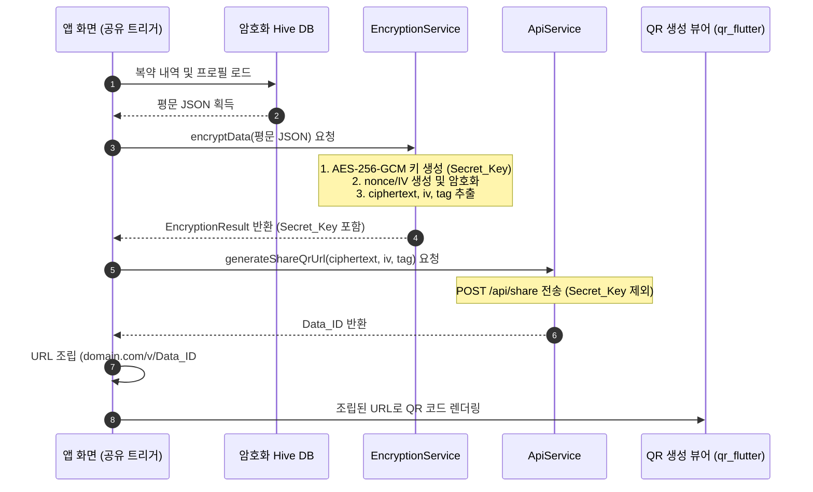

# Flutter App Encryption & Architecture Design

본 문서는 환자용 모바일 앱(Flutter)의 내부 암호화 모듈 설계 및 데이터 영속성 관리 가이드라인을 다룹니다.

---

## 1. 기술 스택 및 의존성 라이브러리 (Dependencies)
앱의 구현을 위해 `pubspec.yaml` 파일에 아래 종속성들을 추가해야 합니다:

```yaml
dependencies:
  flutter:
    sdk: flutter
  
  # 암호화 및 API
  cryptography: ^2.5.0       # AES-256-GCM 종단간 암호화
  http: ^1.2.0               # 중계 서버 통신
  http_parser: ^4.0.0        # 멀티파트 이미지 업로드
  
  # 로컬 암호화 스토리지
  flutter_secure_storage: ^9.0.0 # OS 수준 보안 영역(Keychain/Keystore) 접근
  hive: ^2.2.3                   # 경량 로컬 NoSQL 데이터베이스
  hive_flutter: ^1.1.0           # Hive 플러터 바인딩
```

---

## 2. 모바일 로컬 보안 아키텍처

로컬에 저장되는 환자 프로필 및 복약 로그는 디바이스 자체를 분실하거나 루팅하더라도 데이터가 외부로 유출되지 않도록 **이중 암호화** 구조로 관리합니다.

```text
[ OS 보안 저장소 (Secure Storage) ]
  └── 암호학적 임시 생성된 DB Encryption Key (256-bit)
            │
            ▼ (DB 복호화 키로 주입)
[ Hive 로컬 DB (Encrypted Box) ]
  └── 환자 프로필 (JSON)
  └── 복약 로그 (JSON)
```

### 2.1 Hive 로컬 데이터베이스 암호화 초기화 코드 예시
```dart
import 'dart:convert';
import 'package:flutter_secure_storage/flutter_secure_storage.dart';
import 'package:hive_flutter/hive_flutter.dart';

class LocalStorageService {
  static const String _dbKeyName = 'hive_encryption_key';
  static const String _profileBoxName = 'patient_profile_box';
  
  final _secureStorage = const FlutterSecureStorage();

  Future<void> initDatabase() async {
    await Hive.initFlutter();

    // 1. Secure Storage에서 기존 DB 암호화 키를 불러옴
    String? keyExists = await _secureStorage.read(key: _dbKeyName);
    List<int> encryptionKey;

    if (keyExists == null) {
      // 2. 키가 없을 경우, 새로운 256비트 암호화 키 무작위 생성 후 저장
      final newKey = Hive.generateSecureKey();
      await _secureStorage.write(
        key: _dbKeyName, 
        value: base64Url.encode(newKey)
      );
      encryptionKey = newKey;
    } else {
      encryptionKey = base64Url.decode(keyExists);
    }

    // 3. 암호화 키를 사용하여 안전한 Hive Box 오픈
    await Hive.openBox(
      _profileBoxName,
      encryptionCipher: HiveAesCipher(encryptionKey),
    );
  }
}
```

---

## 3. 종단간 암호화 및 공유 워크플로우

환자가 의료진에게 건강 정보를 공유할 때의 흐름은 다음과 같습니다.



---

## 4. 모바일 처방전 촬영 (AI OCR) 최적화 팁
1. **사진 크기 압축**: 모바일 카메라로 원본 촬영 시 용량이 5MB~15MB에 달하므로 `flutter_image_compress` 등을 통해 반드시 **2MB 이하의 JPEG**로 낮추어 업로드 용량을 최적화하십시오.
2. **촬영 가이드라인 제공**: 카메라 화면 내에 **처방전 영역 가이드 사각형**을 오버레이 디자인하여, 사용자가 글씨가 깨지지 않도록 적정 거리에서 수평으로 촬영하도록 유도하십시오. (Gemini OCR 인식률 급격히 향상됨)
